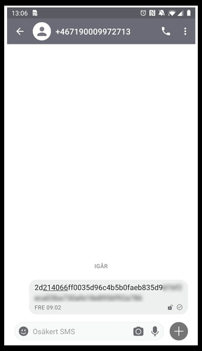

Alert Alarm SMS exploit
#######################

Observation
***********
When turning off an active alarm (ARMED_HOME) an SMS is created similar to
this.

After reverse engineering one can see that the 64 bytes hex string is made up of
two parts. The first part is the IV, which is a random number (coming from
SHA1PRNG) and the second part is the actual message.

.. code-block:: none

           32 bytes   32 bytes
        +-----------+----------+
        | IV        | Message  |
        +-----------+----------+

The encryption in use is AES-CBC and the key used for encryption consists of a
string like this:

.. code-block:: none

        000000000000xxxx

Where "xxxx" is the pin code. This means the the key space is reduced from
128-bits, to only 9999 combinations. The format of the decrypted message is as
follows:

.. code-block:: none

        Bytes:            1   1   1      2       1     2        2        2         2          2   = 16 bytes
                +-----------+---+---+------+---------+-----+------+--------+---------+----------+
                |SMS Version| i | j | year | month-1 | day | hour | minute | user id | \x00\x00 |
                +-----------+---+---+------+---------+-----+------+--------+---------+----------+
                                              (hex)

Here ``i`` is the alarm on (0) off (1) and ``j`` is (TODO).

Unconfirmed potential issues
****************************
- Is the solution susceptible to reply attacks? Is is possible to send the same
  message more than once?

Open questions
**************
- Why leverage on SMS from the app, when there already must be a data connection
  with the app?

- 

Summary
*******
Weaknesses:
- AES key (128bits) is made up from "000000000000" + the pin code, i.e, brute
  force is trivial.

- Using plain AES-CBC with no integrity checking. This means that man in the
  middle can modify messages. AES-CBC is malleable, so changing a bit in the IV
  changes a bit in the plaintext/ciphertext. Which means it is possible for a
  man in the middle to change an SMS meant to turn on the alarm to instead turn
  it off by just flipping some bits in the IV.

The security of the solution relies on
  a) the pin code and
  b) the SMS senders phone number
  c) that no-one is able to get hold of the SMS sent.

In fact, one can argue that the security only relies on "c", since if one get
hold of "c", then it's trivial to figure out "a", that is basically what
the script aaxploit.py does. "b" on the other hand is typically available in
phonebooks etc, i.e., it's usually not hard to figure out the phone numbers to
the owner of a house.

